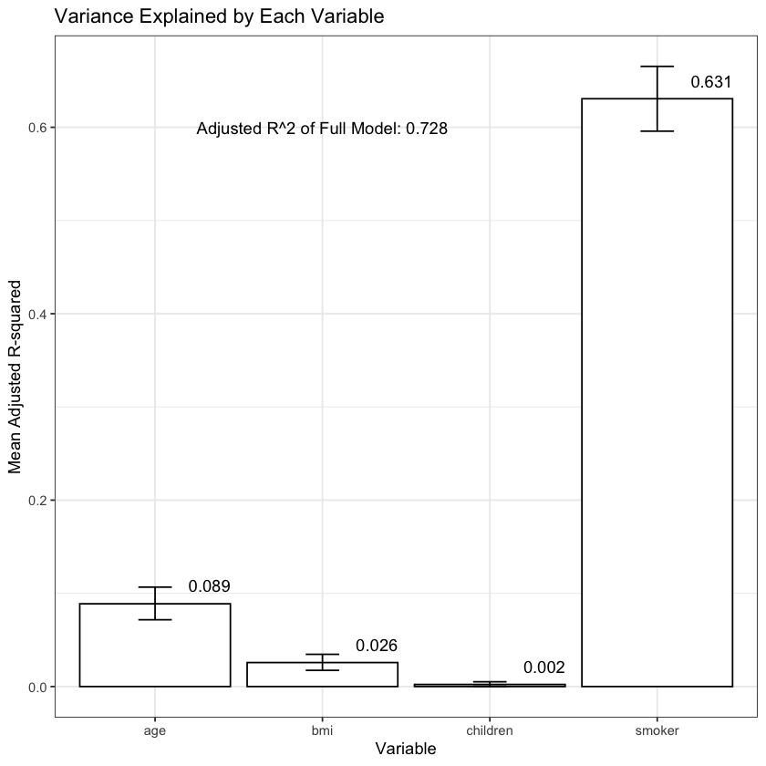

# Variance Analysis Project

## Overview
This project aims to explain the variance in a response variable using a selected set of predictors, including both numerical and categorical variables. The analysis focuses on a moderate-sized dataset (1,000-2,000 rows) and employs statistical modeling techniques to understand which factors most strongly influence the response variable.

## Goals
- Quantify how much variance in the response variable can be explained by the selected predictors
- Identify the most important features influencing the response variable
- Provide interpretable results for both numerical and categorical predictors
- Create a robust model that accounts for relationships between different types of variables

## Approach
The analysis employs several statistical techniques:
- Linear regression with regularization to handle multiple predictors
- Variance decomposition to understand feature contributions
- Proper handling of categorical variables through statistical encoding
- Assessment of model performance and feature importance

## Data Description
https://www.kaggle.com/datasets/mirichoi0218/insurance

## Methods
The project uses established statistical tools and libraries including:
- R
- scikit-learn for some model fitting and validation

## Expected Outcomes
- Quantification of explained variance in the response variable
- Ranking of predictor importance
- Statistical validation of the relationships between predictors and response
- Interpretable insights for both technical and non-technical audiences

